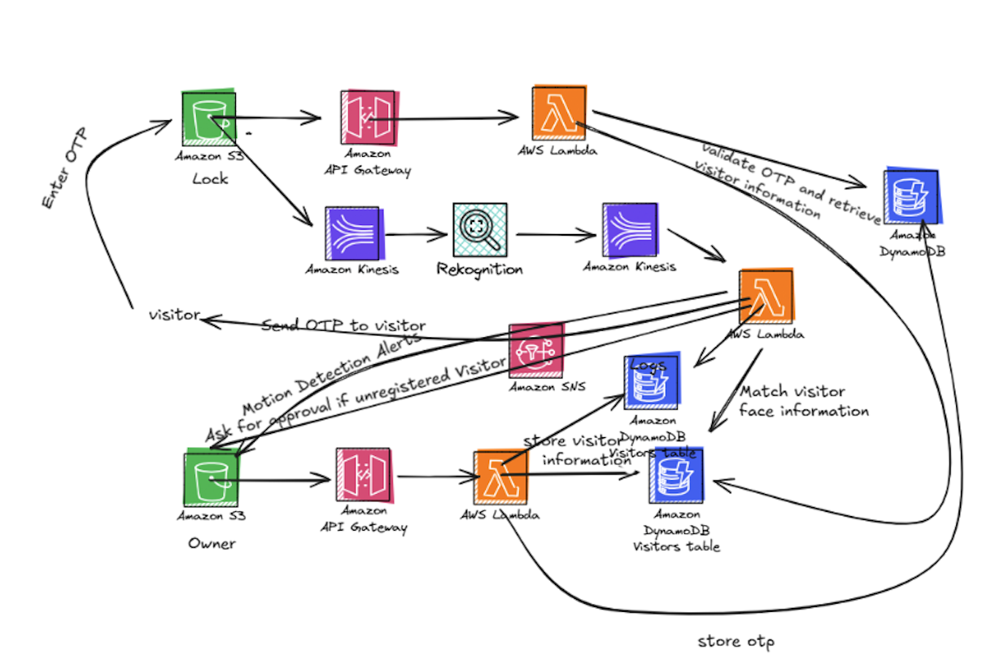

# Real-Time Smart Door Security System Using Cloud-Based Facial Recognition

##  Abstract
This project presents a real-time smart door security system that integrates facial recognition, dynamic access management, and analytics into a unified, cloud-powered solution. By leveraging **AWS services**—specifically Amazon Rekognition, DynamoDB, S3, Lambda, and API Gateway—we created a responsive, serverless platform.

##  Project Demo
Watch the full system demonstration on YouTube:

##  Project Structure

### 1. Frontend
Located in the `/FrontEnd` directory.
- **Owner Portal** (`/Owner_FrontEnd`): Allows the owner to add/remove users and view security logs.
- **Visitor Portal** (`/Visitor`): Interface for visitors to request access via OTP.

### 2. Backend (AWS Lambda)
Located in the `/Lambda` directory. Each function is organized into its own folder:
- **Authentication**: `signupUser`, `validate_password`, `send_otp`, `validate_otp`
- **User Management**: `adduser`, `listusers`, `updateuser`, `deleteuser`
- **Security & Logs**: `MotionDetection`, `unusual-activity`, `fetchLogs`, `analytics`

##  Features
* [cite_start]**Facial Recognition**: Automatically grants access to recognized users using Amazon Rekognition[cite: 8].
* [cite_start]**Visitor OTP**: Unregistered visitors can request a temporary OTP for access[cite: 65].
* **Live Analytics**: Owners can track approvals, rejections, and unlock patterns.
* [cite_start]**Security Alerts**: Suspicious activities trigger alerts stored in S3 and DynamoDB[cite: 36].

##  Tech Stack
* **Cloud Provider**: AWS
* **Compute**: AWS Lambda (Python)
* **Database**: Amazon DynamoDB
* **AI/ML**: Amazon Rekognition
* **API**: Amazon API Gateway
